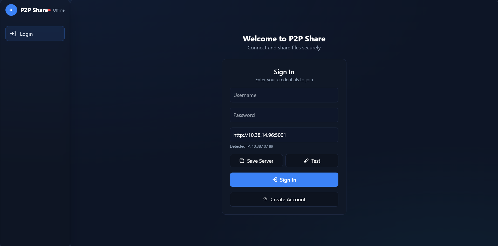
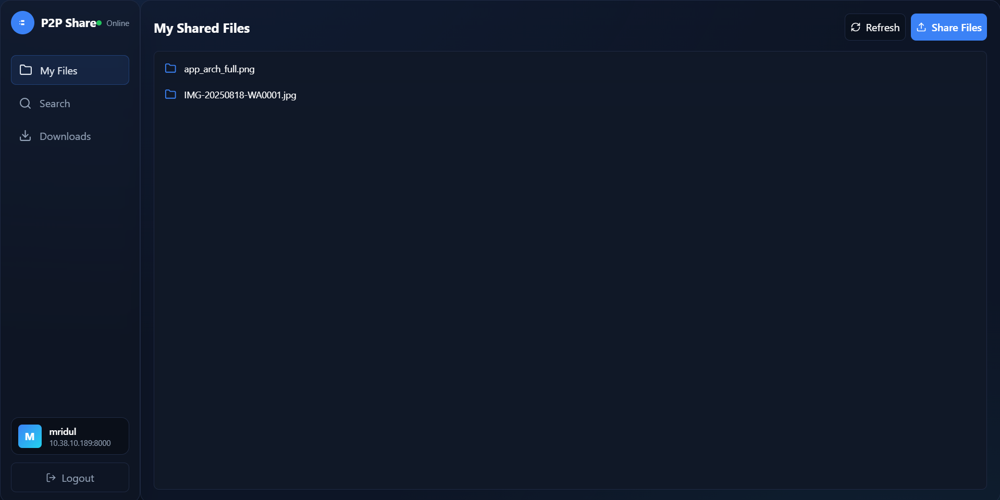
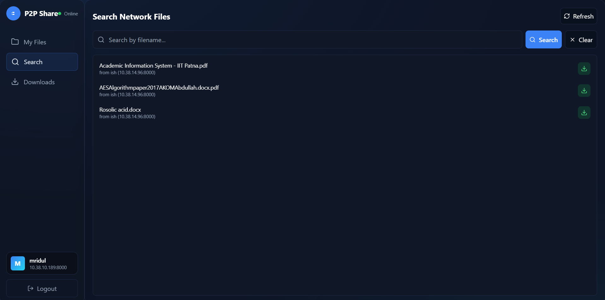

# P2P File Sharing Application (React & Electron)

## Overview

This is a **high-performance desktop P2P file-sharing application** built with a modern tech stack.

* **Frontend**: React + Tailwind CSS, running inside an Electron container.
* **Architecture**: Hybrid P2P model

  * Central server → handles peer discovery and file indexing.
  * Direct peer-to-peer → actual file transfers via Node.js streams.

This design keeps the central server lightweight and scalable, while distributing the file transfer load across peers for **high-speed, concurrent downloads**.

---

## Screenshots

|                |                |
| :------------: | :------------: |
|  |  |
|  |                |


## High-Performance Features

* **Efficient File Streaming**

  * Uses Node.js Streams (`fs.createReadStream` → `net.Socket`) for file transfers.
  * Supports large files with minimal memory overhead.

* **Concurrent Operations**

  * Non-blocking, event-driven I/O model.
  * Seeder can handle **thousands of concurrent downloads**.

* **Performance Benchmarks**

  * **110–120 MB/s** sustained streaming on a wired Gigabit LAN.
  * Stable with **100+ concurrent clients** under stress tests.

---

## Core Features

* **Modern UI**: Responsive and intuitive interface with React + Tailwind CSS.
* **User Authentication**: Secure registration and login managed by the central server.
* **Peer Discovery & Heartbeat**: Clients send heartbeats to maintain network presence.
* **File Sharing & Searching**: Share local files and search across peers.
* **Direct P2P Downloads**: Transfers happen peer-to-peer for maximum efficiency.
* **Real-time Progress**: Track downloads with live speed and progress updates.

---

## Technologies Used

### Electron Client

* **Electron** – Cross-platform desktop framework.
* **React** – UI framework.
* **Tailwind CSS** – Utility-first styling.
* **Node.js** – Runtime for Electron main process & P2P networking.
* **Webpack & Babel** – Bundling and transpiling React code.
* **Portfinder** – Finds open ports for P2P server.

### Central Server

* **Node.js & Express.js** – REST API for peer management.
* **SQLite** – Lightweight database for users & file metadata.

---

## Project Structure

```
p2p-project/
├── server/
│   ├── node_modules/
│   ├── .env
│   ├── cleanup.js
│   ├── db.js
│   ├── p2p.db
│   ├── package.json
│   ├── schema.sql
│   └── server.js
└── client/
    ├── release/
    ├── dist/
    ├── public/
    ├── src/
    │   ├── main/
    │   │   ├── main.js
    │   │   └── preload.js
    │   └── renderer/
    │       ├── components/
    │       ├── index.css
    │       └── index.jsx
    ├── package.json
    └── webpack.config.js
```

---

## Installation and Setup

### Prerequisites

* **Node.js**: Install from [nodejs.org](https://nodejs.org).
* **Git** (optional): For cloning the repo.

---

### Step 1: Set Up the Central Server

1. Navigate to server directory:

   ```bash
   cd server
   ```

2. Install dependencies:

   ```bash
   npm install
   ```

3. Configure environment:

   * Create `.env` file in `server/`
   * Add server IP:

     ```
     SERVER_IP=192.168.1.10
     ```

   *(Replace with actual LAN IP; clients must be on same network)*

4. Start server:

   ```bash
   npm start
   ```

   Runs on **port 5001**.

---

### Step 2: Set Up the Electron Client

1. Navigate to client directory:

   ```bash
   cd client
   ```
2. Install dependencies:

   ```bash
   npm install
   ```

---

### Running the Application (Development)

**Pre-requisite**: Ensure server is running.

Open **two terminals** in `client/`:

1. **Terminal 1 – Start Webpack Watcher**

   ```bash
   npm run watch
   ```

2. **Terminal 2 – Launch Electron**

   ```bash
   npm start
   ```

Login screen → Set **Server URL** to:

```
http://192.168.1.10:5001
```

---

### Building the Application for Production (.exe)

To create a distributable installer:

```bash
npm run package
```

* Builds optimized React app.
* Packages with **electron-builder**.
* Final `.exe` installer → `client/release/`.


